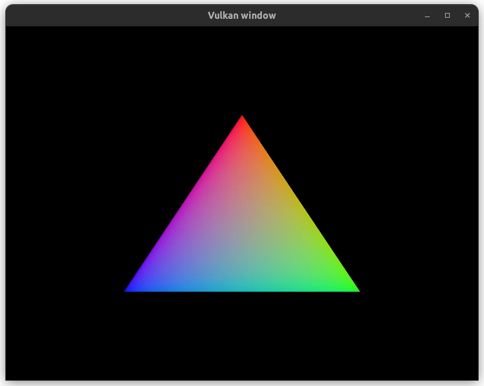

# vulkan_window_linux_port
Vulkan window written in C++ for Linux



## Dependencies
Install Vulkan dependencies
```
sudo apt install vulkan-tools vulkan-sdk libvulkan-dev vulkan-validationlayers-dev spirv-tools
```

Install GLFW dependencies
```
sudo apt install libglfw3-dev
```

Install GLM dependencies
```
sudo apt install libglm-dev
```

Install Xxf68vm and Xi libraries if not installed
```
sudo apt install libxxf86vm-dev libxi-dev
```

## Check the Vulkan Install Works
Run this command and if there is no output, then you are good.
```
vulkaninfo --summary | grep "WARNING"
```

## Resources
My code comments are based on the information from the **Vulkan Tutorial** website.
Followed the instruction from the *Introduction* section and finish up to the *Drawing a triangle* section.
- https://vulkan-tutorial.com/

### Sections of the Vulkan Tutorial website I followed:
- [Introduction](https://vulkan-tutorial.com/Introduction)
- [Overview](https://vulkan-tutorial.com/Overview)
- [Development environment](https://vulkan-tutorial.com/Development_environment)
- Drawing a triangle
    - [Setup](https://vulkan-tutorial.com/Drawing_a_triangle/Setup/Base_code)
    - [Presentation](https://vulkan-tutorial.com/Drawing_a_triangle/Presentation/Window_surface)
    - [Graphics pipeline basics](https://vulkan-tutorial.com/Drawing_a_triangle/Graphics_pipeline_basics/Introduction)
    - [Drawing](https://vulkan-tutorial.com/Drawing_a_triangle/Drawing/Framebuffers)
    - [Swap chain recreation](https://vulkan-tutorial.com/Drawing_a_triangle/Swap_chain_recreation)
